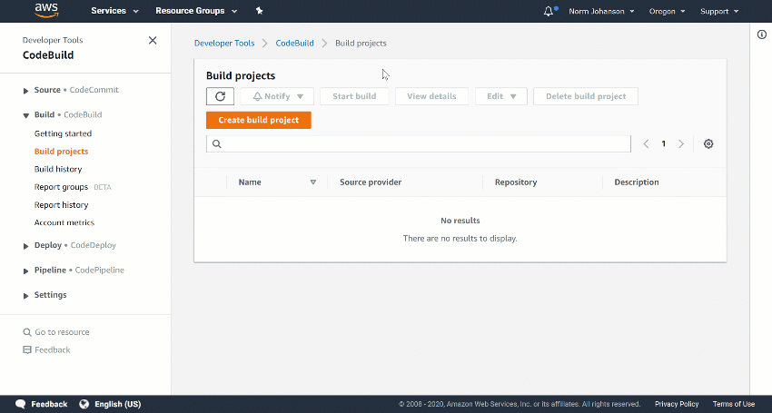

# AWS CodeBuild Test Reporting with .NET Core

At AWS re:Invent 2019, [AWS CodeBuild](https://aws.amazon.com/codebuild/) announced a new test reporting feature which can help make diagnosing test failures in CodeBuild much easier. You can read more about it [here](https://aws.amazon.com/blogs/devops/test-reports-with-aws-codebuild/).

I wanted to use this feature for .NET and after a little research I was able to quickly add support for .NET tests to my CodeBuild projects. Let's take a look at how I made this work.

## Project Setup

For demonstration purposes I have a test project with the following tests. I admit these tests don't really do anything but they will give me 3 passing tests and one failing test for a malformed Uri exception.

```csharp
using System;
using System.Net;
using Xunit;

namespace CodeBuildDotnetTestReportExample.Tests
{
    public class ExampleTests
    {
        [Fact]
        public void TestSuccess1()
        {

        }


        [Fact]
        public void TestSuccess2()
        {

        }

        [Theory]
        [InlineData("https://www.google.com")]
        [InlineData("fffaaa")]
        public void TestMalformedUri(string uri)
        {
            new Uri(uri);
        }
    }
}
```

To run this project with CodeBuild I first started with a `buildspec.yml` file that built my project and ran my tests.

```yaml
version: 0.2

phases:
    install:
        runtime-versions:
            dotnet: 3.1
    build:
        commands:
            - dotnet build -c Release ./CodeBuildDotnetTestReportExample/CodeBuildDotnetTestReportExample.csproj
            - dotnet test -c Release ./CodeBuildDotnetTestReportExample.Tests/CodeBuildDotnetTestReportExample.Tests.csproj
```

The first step to making my test reports was making sure the `dotnet test` command logged the test run. To do that I need to specify the logger format and where to put the logs. I changed the `dotnet test` command shown above to use the `trx` log format and to put the results in the `./testresults` directory.

```yaml
            - dotnet test -c Release <project-path> --logger trx --results-directory ./testresults
```

## What to do with a `trx` format file?

To have CodeBuild use the trx files to create the test reports I needed to add a new `reports` section to the `buildspec.yml` file. This snippet below grabs all of the xml files in the `./testresults` directory to generate test reports under the **DotnetTestExamples** report group in CodeBuild.

```yaml
reports:
    DotnetTestExamples:
        file-format: VisualStudioTrx
        files:
            - '**/*'
        base-directory: './testresults'

```

By default CodeBuild will assume the test log files to be in JUnit XML format. To make sure CodeBuild understands the trx xml files I needed to set the `file-format` field in my `buildspec.yml` file to `VisualStudioTrx`.

Here is now the full version of my `buildspec.yml` that will run by my build, execute tests and collect the test logs for a CodeBuild test report.

```yaml
version: 0.2

phases:
    install:
        runtime-versions:
            dotnet: 3.1
    build:
        commands:
            - dotnet build -c Release ./CodeBuildDotnetTestReportExample/CodeBuildDotnetTestReportExample.csproj
            - dotnet test -c Release ./CodeBuildDotnetTestReportExample.Tests/CodeBuildDotnetTestReportExample.Tests.csproj --logger trx --results-directory ./testresults
reports:
    DotnetTestExamples:
        file-format: VisualStudioTrx
        files:
            - '**/*'
        base-directory: './testresults'
```

## Setting up the build project

A CodeBuild project can be configured with a variety of options, for example what source control provider should be used, or whether to run as a stand alone job, or run as part of a pipeline. For this post I'm going to keep it simple and create a standalone CodeBuild project pointing to a GitHub repository. Here are the steps I used to create the CodeBuild project.

* Sign in to the AWS Management Console and navigate to CodeBuild
* Click **Create build project**
* Set a project name
* Select the GitHub repository
* Configure the Environment image
  * Operating System = Amazon Linux 2
  * Runtime = Standard
  * Image = aws/codebuild/amazonlinux2-x86_64-standard:3.0
  * Service Role = New service role
* Click **Create build project** to finish



Once the project is created we can start a build which will execute the **buildspec.yml** to build the project and run the tests.

## View test report

CodeBuild will capture the test reports identified in the **reports** section of the **buildspec.yml** file as the builds execute, and we can view the test reports identified in the **report group** I named `DotnetTestExamples` in the CodeBuild console. The example below shows my 4 tests ran, and which one failed. Clicking the failed test will give more details about the failure.


## Conclusion

Adding test reports to your CodeBuild project makes it easier to diagnose CodeBuild jobs and you can see how, with just a few steps, you can add reporting to your .NET builds in [AWS CodeBuild](https://aws.amazon.com/codebuild/).
